# 🚀 Data Formating 🚀 <!-- omit in toc -->

When we program, often we need to handle formating data and unformating data. For that we have different method :

- [Libraries](#libraries)
- [Replace a text A per a text B](#replace-a-text-a-per-a-text-b)
- [Regex](#regex)
- [Function](#function)
- [Conclusion](#conclusion)

## Exemple <!-- omit in toc -->
* [python](./python)
* [c#](./csharp)
* [java](./java)
* [javascript](./javascript)

<br>

## Libraries 

Basically just call a tierce library for handling formating data for formating data in CSV format wa have :
* [Apache common CSV (java)](https://mvnrepository.com/artifact/org.apache.commons/commons-csv)
* [csv.py (python)](https://docs.python.org/3/library/csv.html)
* [CsvFormatProvider (c#)](https://docs.telerik.com/devtools/document-processing/libraries/radspreadprocessing/formats-and-conversion/csv/csvformatprovider)

But basically sometime we need to write ourself a way to do formating and unformating for our data so we need to understand how it's work behind the scene. More than that if we realise a formating on our data maybe we will need to reverse this process. When we use a libraries we have almost everytime a way to do formating and unformating on our data so we can reverse our formating for import our data. But when we write a solution ourself often we separate formating data and unformating data when in reality both depend on each other.

## Replace a text A per a text B

When we transform a text A to a text B, we do a simple replacement and for unformating we just need to reverse the step so replace B per A. The graph below show this concept. 

<details>
<summary><CODE>mermaid code</CODE></summary>

```
flowchart TB
    subgraph Replace a text A per a text B
    direction TB
    data-->one-->dataFormating[data formated]-->two-->data
        subgraph one["formating"]
            direction LR
            A-->B-->C-->D
        end
        subgraph two["unformating"]
            direction RL
            D1[D]-->C1[C]-->B1[B]-->A1[A]
        end
    end
```

</details>
<br>
<div style="text-align:center">



</div>

__What that mean ?__

If we have a json file which describe every replacement for formating data with input / output then we can use the same json but for unformating data without changement. We just need to read this json file bottom to top (if we read top to bottom for formating) and consider output as an input for unformating data.  

__note :__

So we see that we perform formating and unformating data with the same function and configuration file. Note that if we use multiple simple replacement that can break because if i have ``"ABCD"`` and want to format that the result will be ```DDDD```, then the reverse will be ```AAAA``` because of that it's better to use regex and function, or only 1 simple replacement. If you want to use multiple replacement you need to make sur that your replacement will not be concurentiel beetween each other so you can't do : 
* ```A-->B-->C-->D```
* but you can ```CAGTG-->Dmodlk``` and ```Bdez-->Cdes``` and ```AAZS-->Bvgr``` because each input/output wasn't contains in an other input output

<br>
<br>

## Regex

When we use Regex we can do a lot of thing such as create parameters inside our pattern for use this parameters on the output and place it where we want. We can also match differents pattern with the same regex expression using OR in regex ```|```. So basically we can't reverse the process easily, we need a Regex expression for formating and an other regex expression for unformating data.

* [cheatsheet article for regex](https://medium.com/factory-mind/regex-tutorial-a-simple-cheatsheet-by-examples-649dc1c3f285)
* [freecodecamps course with regex practice](https://www.freecodecamp.org/learn/javascript-algorithms-and-data-structures/)

<br>
<br>

An exemple :
<br>

__formating data :__
```
input : ([A-Z]+)([0-9]+)([A-Z])
output : $3$1$2
```
* entry data : ABCD89J 
* output data : JABCD89
  
why we create 3 variables inside our pattern matching certain chain of character, in our case 3 sub-patterns ```[A-Z]+``` reflecting by the output ```$1```, ```[0-9]+``` reflecting by the output ```$2```, and ```[A-Z]``` reflecting by the output ```$3``` but for the output we choose to keep every data but replace on an other place.

<br>

__unformating data :__

for reverse we need a complete different patterns :
```
input : ([A-Z])([A-Z]+)([0-9]+)
output : $2$3$1
```
* entry data : JABCD89
* output data : ABCD89J

<br>

__What that mean?__

If we use a couple of Regex for formating data we will need a couple of Regex for unformating the data too. So if we use a json file for configuration we will need 
* formating data :
  * regex-formating-input
  * regex-formating-output
* unformating data :
  * regex-unformating-input
  * regex-unformating-output

<br>
<br>

## Function

A function can be a composition of other method (libraries, regex, simple replacement), that's mean we need a function for formating data and unformating data too.

<br>
<br>

## Conclusion

Because of this observation i write a generic method for handling formating / unformating data using a json configuration file who look like this :
```json
[
  [
    {
      "replacement": {
        "input": "C",
        "output": "D"
      }
    }
  ],
  [
    {
      "replacement": {
        "input": "A",
        "output": "Z"
      }
    }
  ],
  [
    {
      "replacement": {
        "input": "G",
        "output": "B"
      }
    }
  ],
  [
    {
      "regex": {
        "regex-unformating-input": "([A-Z])([A-Z]+)([0-9]+)",
        "regex-unformating-output": "\\2\\3\\1",
        "regex-formating-input": "([A-Z]+)([0-9]+)([A-Z])",
        "regex-formating-output": "\\3\\1\\2"
      }
    }
  ],
  [
    {
      "function": {
        "function_formating": "name of the function for formating data",
        "function_unformating": "name of the function for unformating data"
      }
    }
  ]
]


```

And i write the method on few different programming languages whose interest me because they are use for web development. But depending on the language regex need to be ajusted because the output can be a little bit different depending on the way the regex using parameter are handling for example in c# when we want introduce regex as a string with parameters we need escaping some character so the input / output can be a little bit different inside the json file but the logic behing that still the same, meaning handling formating and unformating data with the same method and same configuration file too. The difference beetween formating and unformating data will be a simple bool parameters on the function. 
```python
def formating(data, path, reverse):
    ...

    return result

```
* data = data we want to format should be a string
* path = path for the configuration file
* reverse = a boolean if false then we perform a formating on the data otherwise we perform an unformating
* result = the output data should be a string

